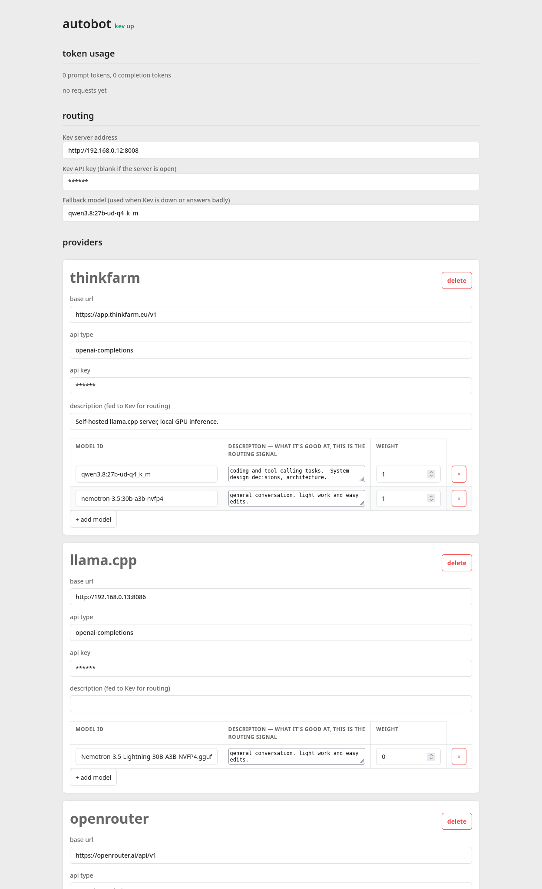

# autobot

OpenAI-compatible inference gateway that routes each request to the best
provider/model using a [Kev](https://github.com/jaredpalmer/kev) (System One)
decision endpoint.

This means at every question and every tool call the model may change.  

I would recommend a simple dual routing approach.  One smarter, expensive model with a routing description: 

_"coding and tool calling tasks.  System design decisions, architecture. intelligent consideration."_

and a faster, cheaper model with the description: 

_"general conversation. light work and easy edits."_

The resulting context grows as the result of both models, and is a reasonable attempt at getting the best of both worlds. 


```bash
.venv/bin/pip install -r requirements.txt
cp providers.example.json providers.json  # then edit in your real providers (gitignored — it holds API keys)
PORT=8010 .venv/bin/python autobot.py     # env: PORT, KEV_URL, CONFIG_PATH, TIMEOUT_SECS
.venv/bin/python autobot.py --selftest    # offline checks
```

## How it works

- `POST /v1/chat/completions` — accepts any OpenAI chat-completions body.
  - If `model` names a configured model id, it's used directly (no routing).
  - Otherwise the messages (first ~2000 tokens) go to Kev as one `choice`
    question whose options are the configured models with their descriptions.
    Two passes run concurrently — normal and reversed option order — and the
    probabilities are averaged: this checkpoint has a strong last-option
    position bias (verified via `/v1/systemone/permute`, argmax flips between
    orders), and averaging both orders cancels it at ~zero extra wall time.
  - The request is forwarded verbatim (except `model`) to the chosen provider;
    `stream: true` passes SSE chunks through untouched. Kev down or a bad
    answer falls back to `defaultModel`.
- `GET /v1/models`, `GET /health` — OpenAI-style listing and status.
- Config is re-read from disk per request, so editing `providers.json`
  (or saving via the UI) takes effect immediately.

## Web UI



Open `http://localhost:PORT/`. A single page for editing config without
touching JSON:

- **routing** — Kev server address and fallback-model dropdown (lists every
  configured model id).
- **providers** — one card per provider with base URL, api type, API key,
  description, and a table of its models (id + routing description);
  add/delete providers and models in place.
- **Save config** — validates then writes `providers.json` atomically
  (`POST /api/config`); since the file is re-read per request, changes are
  live immediately. The header shows Kev up/down, polled from `/health`
  every 5s.

Backing JSON endpoints: `GET/POST /api/config`, `GET /api/routes` (last ~200
routing decisions with probabilities).

Note: the UI has no auth and displays API keys in plain fields — keep it on a
local/private interface, don't expose it publicly.

## providers.json

```json
{
  "kevUrl": "http://host:port",        # optional — overrides the KEV_URL env default
  "defaultModel": "<model id used when Kev is unavailable>",
  "providers": {
    "name": {
      "baseUrl": "https://host/v1",
      "api": "openai-completions",
      "apiKey": "...",
      "description": "optional, fed to Kev",
      "models": [
        { "id": "model-id", "description": "what this model is good at — Kev routes on these" }
      ]
    }
  }
}
```

Descriptions are the routing signal: make them specific about what each model
is suited for.

## Sample Results

| Model | Requests | Prompt Tokens | Completion Tokens | Input Cost | Output Cost | Total Cost |
|-------|----------|---------------|-------------------|------------|-------------|------------|
| nemotron-3.5:30b-a3b-nvfp4 | 28 | 596,443 | 15,075 | 0.06 | 0.20 | 0.039 |
| qwen3.8:27b-ud-q4_k_m | 7 | 17,612 | 16,787 | 0.75 | 2.50 | 0.055 |
| **Total** | **35** | **614,055** | **31,862** | | | **0.094** |
| without autobot | 35 | 614,055 | 31,862 | 0.75 | 2.50 | 0.540 |

This example demonstrates the benefit of routing between two model tiers: a capable model for complex tasks (coding, system design, tool use), and a cheaper model for general conversation and light edits.

While token usage is similar across models, the cost difference is substantial — the routing strategy leverages each model's strengths to minimize expense without sacrificing capability.

